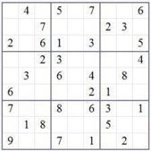
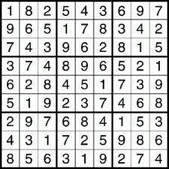

## PHP Sudoku Test

The classical Sudoku is a game, where the player needs to fill the gaps in a matrix of numbers (left image) in a way 
that three constraints are met:  
Every number between 1 and 9 can only be present exactly once in each of the

 * nine rows
 * nine columns
 * nine 3x3 boxes

Example of an unsolved game:



Example of a solved game:




### Task

Please write modern standard PHP code that checks if the completed Sudoku (right picture) is solved correctly. Think of 
a good data structure and keep track of the time used.  
When sending your solution, please describe the thought process of your solution and openly share how long it took you.   
Imagine we were working together and you were expected to solve this task in the time you stated, so be honest ;-)

#### Solution
**Functional tests started to be green in 1 hours 39 minutes - counting from creating notes on paper. After that I spend 
about 30 minutes to clear code a bit with fixing it if any test fails after changes. I did not do all this stuff in 
a rush.  
You need PHP 7.4 and run `composer install` inside project folder if you want to run `tests`.**
  
In the beginning, when I am in a search for solving a new task, I usually like to write down a problem on the sheet of 
paper. I helps me a lot to visualize the given problem and quickly find the ways to solve this.  
Most common way to store data in PHP is an array structure. It can be used to get input data from user. So I decided 
that there will be an array, which contains lines (rows), and lines contains cells:
```
[
 [1, 8, 2, 5, 4, 3, 6, 9, 7],
 [9, 6, 5, 1, 7, 8, 3, 4, 2],
 [7, 4, 3, 9, 6, 2, 8, 1, 5],
 [3, 7, 4, 8, 9, 6, 5, 2, 1],
 [6, 2, 8, 4, 5, 1, 7, 3, 9],
 [5, 1, 9, 2, 3, 7, 4, 6, 8],
 [2, 9, 7, 6, 8, 4, 1, 5, 3],
 [4, 3, 1, 7, 2, 5, 9, 8, 6],
 [8, 5, 6, 3, 1, 9, 2, 7, 4]
]
```
For response from this method, we can use array with status and errors array if eny exists:  
```
['status' => false, errors => ['...']]
```
We can use DTO there and as input value, but I decided to not overcomplicate the code.  
That is obvious, that we need one approach to test all cases - lines, columns and boxes. We need to decide, does each  
line, column or box contains duplicated cells or not.  
As line is most accessible for us, I started to think how to validate this structure as an array. Most simple apporach 
there is to use `foreach` construction for array elements and check if we have duplicates. But, I constantly use the 
trick with turning array inside out in such cases. There is a native PHP method for such things - `array_flip()`. It 
flips key-value for array. Reason of using this flipped array is that if we have duplicates, array will be shorter, than 
it should - duplicate will replace one of the existed values. So what we have to do is to check if `count(array_flip())` 
returns us a correct quantity of array items. At this point, we have a mechanism to validate array for duplicates.  
Using this investigation, I can start to write down code.  
I prefer to always work with data, that was validated, and I started with writing a test/fails/code/success/repeat 
strategy (TDD).  
So I run IDE and created new project. Then I copied simple composer.json and phpunit.xml files from previous projects 
(I need tests and autoloading).  
First, I wrote a functional test at, with given solution (SudokuCheckFunctionalTest class), to check how progress is 
going (using SudokuCheck class with implementation). It will fail till code will not be completed.  
Then, I created a test, that checks if empty array forces to error after validation. It fails. So I added check for 
empty input value.  
So, by this method, I wrote tests and code for input value with not enough lines and columns.  
Another thing we should validate for - user can put empty cells, or even use wrong type there. So I wrote test and then 
code to pass this case.  
After first validation passed, I am confident I work with the fully filled board, have correct quantity of lines, 
columns and cells are filled with numbers. Given that, I can move forward and check compliance with the rules of the 
game.   
Let's start with lines. At this point I realised that I need to split logic to different peaces. What I decided to do is 
to use Chain of Responsibilities pattern. I created ValidationTest class and Validation class for implementation. 
Although, there are Link Abstract class and Check Interface were created to simplify code a bit. I put 
`setNext(Check $check): Check` method (to set next class to call) and check method `check(array $board): array` (to use 
for handling rather to call next link in chain or to return empty array).  
Then, I moved written tests of validation from SudokuCheckTest class and placed to ValidationTest class. Although, code 
was moved from SudokuCheck to Validation.  
SudokuCheck class was modified to call validation. Then I run tests (both functional and unit), got some of them failed.
 So I fixed issues, and got all tests green. Awesome.  
I created LinesCheckTest with relative implementation class and created test to fail that LinesCheck class returns 
errors if any exists. After that I implemented code to check if each line flipped have acceptable number of items. So 
test passed. Then I created new test to check if it returns empty array if no errors were found. Run it and it fails. 
I did some tweeks in code and run tests again. All green.  
Next step is to check if columns contains duplicated values. I created ColumnCheckTest and ColumnsCheck classes and 
wrote test to fail. So there is a pretty simple decision. We need to invert lines to columns. So I used two `for` 
constructions inside each other, and simply went through each cell:
```
for ($columnNum = 0; $columnNum < self::DEFINING_NUMBER; $columnNum++) {
    for ($lineNum = 0; $lineNum < self::DEFINING_NUMBER; $lineNum++) {
        $columns[$columnNum][$lineNum] = $board[$lineNum][$columnNum];
    }
    if (count(array_flip($columns[$columnNum])) < self::DEFINING_NUMBER) {
        $errors[] = 'duplicated value at column ' . ($columnNum + 1);
    }
}
```
After each internal `for` loop, I got new column, which can be checked for duplicates by the same `array_flip` function.  
Test become green.  
Then, I wrote a new test, checking if ColumnsCheck class returns empty array if no errors found. Same as for LineCheck 
class.  
Next step is to check Boxes for duplicates. This is where I became thoughtful. I wanted to do as low iterations as 
I can. So main target was to create array with items for each box, without creating array of lines for each box.  
Having that, at the end of the day I decided to simply go through each line of board, add iteration for box number, and 
added a rollback mechanism for this box number till tree boxes "filled":
```
$boxes = [];
$boxNum = 0;
$tactIterations = 0;
$linesToBoxPassed = 0;

foreach ($board as $line) {
    foreach ($line as $c => $cell) {
        $boxes[$boxNum][] = $cell;
        $tactIterations++;
        if ($tactIterations === self::BOXES_ON_LINE) {
            $boxNum++;
            $tactIterations = 0;
        }
    }
    $linesToBoxPassed++;
    if ($linesToBoxPassed < self::BOXES_ON_LINE) {
        $boxNum = $boxNum - self::BOXES_ON_LINE;
    }
    if ($linesToBoxPassed === self::BOXES_ON_LINE) {
        $linesToBoxPassed = 0;
    }
}
```   
Other steps are pretty familiar. Create test - it fails. Write code for box validation. Test passed. Add test for result
 with no errors. Test fails. Write code - test passes.  
Only thing left is to update main class SudokuCheck to use full chain of checks and add functional test for failed 
scenario.  
This method in not the best. There are lots of opportunities for improvement. As you can see, some iterations repeats in 
different checks. "Best the enemy of the good". I decided to stop at this point and зlay with optimization in my spare 
time. Although, I deliberately did not remove some duplicate parts of the code to left the space for future changes and 
improvements.